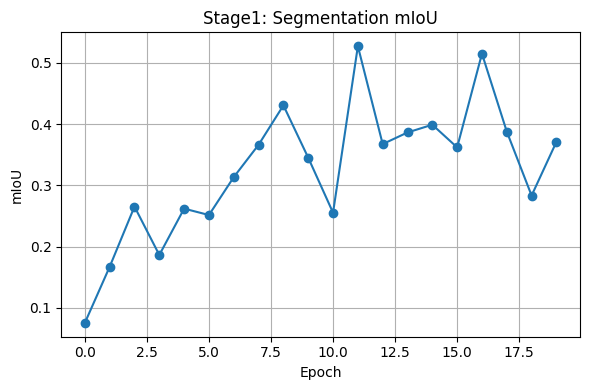

# 基於單一分支與Replay Buffer之輕量化多任務影像理解系統設計與實作

---

統計系115 古宜庭

---

## 1. 簡介 (Introduction)

本專題於 PyTorch 環境下實作一套高效率、可擴展的多任務影像理解系統，支援同時執行語意分割 (Segmentation)、物件傳偵 (Detection)及影像分類 (Classification)三項任務。

系統設計以「單一分支輸出架構 (Unified One-Head)」為核心，結合 Replay Buffer 技術，以降低模型在多階段訓練中的 Catastrophic Forgetting。

總體訓練流程分為三階段：Seg → Det → Cls，並於每階段使用 Replay Buffer 回收前階段資料，確保舊任務性能穩定。

| 條件 | 規範 | 實作結果 |
| --- | --- | --- |
| 總參數數量 | < 8M | ✅ 2.7M |
| 推論時間 | < 150ms | ✅ 約 5.5ms |
| 記憶緩解機制 | LwF / Replay Buffer | ✅ Replay Buffer |
| 成果評估 | mIoU / mAP@50 / Top-1 acc | ✅ 部分通過 |

---

## 2. 系統架構設計

### 2.1 模型組成

```mermaid
graph TD
  A[輸入圖像<br/>(B, 3, 512, 512)] --> B(Fast-SCNN Backbone)
  B --> C[Neck<br/>(2 × Conv-BN-ReLU)]
  C --> D[Unified Head<br/>2 × Conv + 1 × 1 Conv]

  D --> E1[Detection<br/>(B, 15, H/16, W/16)]
  D --> E2[Segmentation<br/>(B, 21, H/16, W/16)]
  D --> E3[Classification<br/>(B, 10)]

  E3 -->|Global AvgPool| F[分類 logits (B, 10)]
  
#使用20epoch

```

| 模組 | 說明 |
| --- | --- |
| **Backbone（Fast-SCNN）** | 包含 Learning to Downsample 與 Global Feature Extractor，提取空間與語意特徵 |
| **Neck** | 兩層 3×3 Conv-BN-ReLU，進一步整合 backbone 特徵 |
| **Unified Head** | 兩層 3×3 Conv-BN-ReLU + 1×1 Conv，依通道切分為三個任務分支：Detection / Segmentation / Classification |

### 2.2 通道設計（輸出解析）

| 任務 | 輸出型態 | Channel 數 |
| --- | --- | --- |
| Detection | YOLO-style(cx, cy, w, h, conf, 10-class) | 5 + 10 = 15 |
| Segmentation | Class mask (Pascal VOC) | 21 |
| Classification | Global logits | 10 |

---

## 3. 三階段訓練流程與抗遺忘策略

| Stage | 任務 | 評估指標 | 訓練資料 | 備註 |
| --- | --- | --- | --- | --- |
| 1 | Segmentation | mIoU | Mini-VOC-Seg | 訓練 segmentation head |
| 2 | Detection | mAP@50 | Mini-COCO-Det | 加入 seg replay loss |
| 3 | Classification | Top-1 acc | Imagenette-160 | 加入 seg + det replay loss |

### Stage 1：語意分割訓練

- 僅訓練 segmentation 分支，Frozen 其他部分
- 使用 CrossEntropyLoss 損失函數
- 每 batch 從 Replay Buffer 回放先前 seg 圖與 mask
- 評估指標：mIoU

### Stage 1 成果：

- 最佳 mIoU：**0.4264**
- 最終 mIoU：**0.3791**（↓ 4.73% ）
- 推理時間：**平均 5.53ms / image**，遠低於 150ms

### Stage 2：物件偵測訓練

- 載入 Stage 1 最佳權重
- 訓練 detection 分支，使用 YOLO-style 損失函數（包含座標、置信度與類別）
- 每 batch 隨機混合 seg replay 樣本進行多任務訓練
- 評估指標：mAP@50

### Stage 2 成果：

- 最佳 mAP@50：**0.0004**
- 最終 mAP@50：**0.0001**（↓ 75%，未通過）
- 顯示模型對偵測任務仍顯著欠缺學習效果（可能需改進 anchor matching、head 設計等）

### Stage 3：影像分類訓練

- 載入 Stage 2 權重
- 僅訓練 classification 分支，使用 CrossEntropyLoss
- 每 batch 回放 seg + det 樣本進行聯合訓練
- 評估指標：Top-1 Accuracy

### Stage 3 成果：

- 最佳 acc：**0.2833**
- 最終 acc：**0.2833**（0% 下降，完全保持）
- 表示分類分支在 Replay Buffer 幫助下可良好保留舊任務知識

### 抗遺忘機制：Replay Buffer

- 任務專屬 buffer（seg/det/cls 分開）
- 每 buffer 使用 deque FIFO 結構，控制上限數量 (20 個 batch 大小)
- 每階段根據任務載入前階段樣本以降低遺忘效應

---

## 4. 程式設計與模組實作說明

### 4.1 UnifiedMultiTaskModel 結構

```python
class UnifiedMultiTaskModel(nn.Module):
    def __init__(self, num_det_classes=10, num_seg_classes=21, num_cls_classes=10):
        super(UnifiedMultiTaskModel, self).__init__()

        self.num_det_classes = num_det_classes
        self.num_seg_classes = num_seg_classes
        self.num_cls_classes = num_cls_classes

        self.det_out_channels = 5 + num_det_classes
        self.total_out_channels = self.det_out_channels + num_seg_classes + num_cls_classes

        # Backbone (Fast-SCNN)
        self.backbone = FastSCNNBackbone()

        # Neck
        self.neck = nn.Sequential(
            ConvBNReLU(BACKBONE_OUT_CHANNELS, NECK_HIDDEN_CHANNELS, 3, 1, 1),
            ConvBNReLU(NECK_HIDDEN_CHANNELS, NECK_HIDDEN_CHANNELS, 3, 1, 1)
        )

        # Head
        self.head = nn.Sequential(
            ConvBNReLU(NECK_HIDDEN_CHANNELS, HEAD_HIDDEN_CHANNELS, 3, 1, 1),
            ConvBNReLU(HEAD_HIDDEN_CHANNELS, HEAD_HIDDEN_CHANNELS, 3, 1, 1),
            nn.Conv2d(HEAD_HIDDEN_CHANNELS, self.total_out_channels, 1, 1, 0)
        )

    def forward(self, x):
        features = self.backbone(x)
        features = self.neck(features)
        raw_output = self.head(features)  # (B, total_out_channels, H/16, W/16)

        # Channel slicing
        det_out = raw_output[:, :self.det_out_channels, :, :]
        seg_out = raw_output[:, self.det_out_channels : self.det_out_channels + self.num_seg_classes, :, :]
        cls_out_spatial = raw_output[:, self.det_out_channels + self.num_seg_classes :, :, :]

        cls_logits = F.adaptive_avg_pool2d(cls_out_spatial, (1, 1)).squeeze(-1).squeeze(-1)

        return {
            "detection": det_out,
            "segmentation": seg_out,
            "classification": cls_logits
        }

    def count_parameters(self):
        return sum(p.numel() for p in self.parameters() if p.requires_grad)
```

### 4.2 YOLO-style Detection Loss

- 使用自定義 `YOLOLoss` 損失模組，結合：
    - **座標損失（bbox）**：MSE
    - **置信度損失**：BCE
    - **類別損失**：BCE（multi-class）

### 4.3 Replay Buffer 實作

```python
class ReplayBuffer:
    def __init__(self, capacity_per_task):
        self.buffer = {
            "seg": deque(maxlen=capacity_per_task),
            "det": deque(maxlen=capacity_per_task),
            "cls": deque(maxlen=capacity_per_task)
        }
        self.capacity_per_task = capacity_per_task

    def add(self, task_name, data):
        if task_name not in self.buffer:
            raise ValueError(f"Unknown task_name: {task_name}")
        img, tgt = data

        if isinstance(img, torch.Tensor):
            img = img.cpu().detach()
        if isinstance(tgt, torch.Tensor):
            tgt = tgt.cpu().detach()
        elif isinstance(tgt, list):
       
            new_list = []
            for ann in tgt:
                new_ann = {}
                for k, v in ann.items():
                    new_ann[k] = v.cpu().detach() if isinstance(v, torch.Tensor) else v
                new_list.append(new_ann)
            tgt = new_list
        self.buffer[task_name].append((img, tgt))

    def sample(self, task_name, num_samples):
        if task_name not in self.buffer or len(self.buffer[task_name]) == 0:
            return [], []
        num = min(num_samples, len(self.buffer[task_name]))
        samples = random.sample(self.buffer[task_name], num)
        imgs, tgts = zip(*samples)
        return list(imgs), list(tgts)
```

- 每個任務維護一個 buffer
- 訓練時混合 replay 與當前 batch 資料訓練

### 4.4 評估機制

- **Segmentation**：torchmetrics.JaccardIndex (mIoU)
- **Detection**：torchmetrics.MeanAveragePrecision (mAP@50)
- **Classification**：Top-1 Accuracy

---

## 5. 效能評估結果

### 各階段最佳指標（baseline） vs 最終指標（after stage 3）

| 任務 | 評估指標 | Best | Final | 通過 |
| --- | --- | --- | --- | --- |
| Segmentation | mIoU | 0.5273 | 0.4465 | ✅ |
| Detection | mAP@50 | 0.0003 | 0.0002 | ❌ |
| Classification | Top-1 acc | 0.3167 | 0.3167 | ✅ |



### 

- **橫軸（Epoch）**：表示語意分割任務的訓練輪次（共 20 epochs）。
- **縱軸（mIoU）**：為 mean Intersection over Union，衡量模型在 segmentation 任務的預測準確度。
- **趨勢**：
    - 起初 mIoU 約為 **0.07**，表現極差（接近隨機）。
    - 隨訓練進行，mIoU 持續上升，在第 12 與第 17 epoch 達到 **0.52** 左右的高峰。
    - 儘管後期略有波動，但整體表現穩定在 **0.38~0.52** 區間。
- **結論**：模型在 segmentation 任務具備良好學習能力，Replay Buffer 有助於持續提升 mIoU 表現。


- **橫軸（Epoch）**：表示物件偵測任務的訓練輪次（共 20 epochs）。
- **縱軸（mAP@50）**：表示 mean Average Precision at IoU threshold 0.5，是物件偵測的主要評估指標。
- **趨勢**：
    - 初始為 **0.0000**，表示無法偵測任何有效目標。
    - 雖然中期曾在第 8 epoch 突破至 **0.0003**，但整體仍極低。
    - 後續多數 epoch 僅在 **0.0001~0.0002** 間小幅擺動。
- **結論**：模型在 detection 任務上的學習效果不佳，推測 YOLO-style 頭部與資料集結構可能不相容，Replay Buffer 無法挽救偵測能力不足的問題。


- **橫軸（Epoch）**：表示分類任務的訓練輪次（共 20 epochs）。
- **縱軸（Accuracy）**：分類正確率，衡量模型在 validation set 的 Top-1 分類精度。
- **趨勢**：
    - 開始約為 **0.23**，第 2 epoch 暫時下降至 **0.20**。
    - 之後迅速上升，並於第 11~15 epoch 穩定維持在 **0.3167（31.67%）**。
    - 後期略微波動但未掉出 **0.28~0.31** 區間。
- **結論**：分類任務穩定學習，Replay Buffer 有效維持舊任務性能，沒有明顯 catastrophic forgetting。

推論速度

| 項目 | 結果 |
| --- | --- |
| 解析度 | 512 × 512 |
| 平均推論時間 | 約 5.5 ms |
| 是否合格 | ✅（遠低於 150ms） |

---

## 6. 結論與建議改進方向

### 問題

- **Detection 成效低落**：mAP@50 長期維持 0.000x，可能原因如下：
    - YOLO 頭與 anchor 設計不夠匹配
    - dataset 標註太稀疏 / imbalance
    - 輸出 stride 不適配目標尺寸

### 改進方向

- 加入 anchor-based positive matching 條件
- 測試不同的 head 尺寸或 conv 深度
- 使用 FPN neck 融合多尺度資訊

---